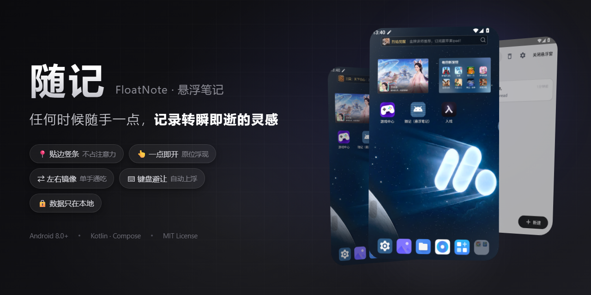

<div align="center">



# 随记 · FloatNote

**任何时候随手一点，记录转瞬即逝的灵感。**

[](LICENSE)
[](https://developer.android.com)
[](https://kotlinlang.org)
[]()
[]()

一个 Android 悬浮笔记 + AI 助手应用：平时只在屏幕边缘留一根半透明竖条，点一下，笔记窗口原位浮现——写完收起，回到刚才的事；卡片左下角的 AI 按钮，随叫随到一个能看图、能思考、能存笔记的大模型助手。**不打断，是它存在的全部理由。**

</div>

---

## 交互模型

**贴边竖条 ↔ 悬浮笔记窗 ↔ AI 助手**，三态互斥、位置互相衔接（长条中心 = 竖条中心，AI 输入框/面板在悬浮窗原位浮现）：

| 操作 | 动作 |
|---|---|
| 点竖条 | 笔记窗**原位浮现** |
| 点长条手柄 | 整窗轻移淡出，竖条原位归来 |
| 按住长条拖动 | 移动窗口位置 |
| 双指捏合 / 拖角 | 调整窗口大小 |
| 工具栏 ⇄ 键 | 整窗翻到屏幕另一侧，左右布局全部镜像，单手通吃 |
| 点卡片左下角 AI 按钮 | 悬浮窗收为竖条，**AI 输入框原位浮现** |
| 发送问题 | 输入框原位绽放成对话面板，流式输出回答 |
| ✕ 收起 AI | 回到竖条，笔记窗原位归来 |

## 功能亮点

**悬浮窗**
- 贴边竖条收起态：约 30% 透明度（可调），几乎不占注意力
- 键盘避让：窗口在屏幕下半时唤起键盘自动浮到键盘上方，收起键盘自动回落
- 键盘优先：未聚焦时第一次点正文只弹键盘，再点才定位光标
- 三档质感（标准 / 高光 / 柔光）、颜色 / 透明度 / 圆角 / 厚度 / 长度全参数化，实时生效
- 开机自启（可选）：重启后悬浮窗自动回来

**AI 助手（v2.1，需自配 OpenAI 兼容接口）**
- 一键唤起：悬浮窗卡片左下角半透明按钮，窗口原位变输入框，问题发出原位绽放成对话面板
- 流式回答：打字机效果 + 三点等待动画 + Markdown 渲染（加粗 / 列表 / 标题 / 代码）
- 多模态：插入相册图片自动走视觉模型；灯泡开关切换思考模型（如 DeepSeek-R1）
- 三个模型位：普通 / 思考 / 视觉，按消息内容自动路由；任意 OpenAI 兼容端点（DeepSeek、GLM、本地模型均可）
- 产出回流：回答一键存为笔记；＋菜单插入当前笔记作上下文提问（"帮我整理这篇"）
- 贴心细节：剪贴板速贴历史、建议指令气泡、草稿保留、收起后台续生成、多轮追问、错误可重试

**主界面**
- 笔记列表：搜索（标题 + 正文）、置顶、长按操作
- 编辑器：有序 / 无序列表、待办、时间戳，回车自动续点
- 回收站：删除先进回收站保留 30 天，可恢复 / 彻底删除 / 清空
- 备份：导出全部笔记为纯文本、从文件导入（自动跳过重复）

**数据**
- 自动保存（1 秒防抖），笔记数据只存本地 Room 数据库
- AI 为可选功能：不配置即不联网，配好后的网络请求仅发往你自己填写的接口地址


## 下载

从 [Releases](../../releases) 页面获取 APK 安装包。安装后：

1. 打开应用，点顶栏「悬浮窗」
2. 按系统引导授予"显示在其他应用上层"权限

**启用 AI 助手（可选）**：设置 → AI 助手，填入任意 OpenAI 兼容接口的地址与 API Key（如 DeepSeek、智谱，或本地 Ollama），普通模型必填、思考 / 视觉模型选填，「测试连接」通过后即可使用。

也可以自行构建（见下）。欢迎 [反馈问题](../../issues)。

## 权限与隐私

- **悬浮窗权限（显示在其他应用上层）**：核心功能所需，承载笔记悬浮窗与 AI 助手浮层
- **网络（INTERNET）**：仅 AI 助手使用——接口地址（OpenAI 兼容）与模型全部由你在设置中自配；笔记本体零网络请求
- **API Key 加密存储**在设备本地（Android Keystore），不随笔记数据备份导出，不上传任何服务器
- **剪贴板**：仅在打开 AI 输入框或点开剪贴板面板时读取一次（用于"剪贴板速贴"历史），只保留最近 10 条、仅存内存，不落盘
- 笔记数据全部本地存储（Room）；无账号、无云同步、无统计 SDK；AI 对话仅存内存，重启即清

## 构建

```bash
git clone <本仓库>
cd FloatNote
gradlew assembleDebug      # Debug 包
gradlew assembleRelease    # Release 包（沿项目惯例使用 debug 签名，发布请自行配置签名）
gradlew testDebugUnitTest  # 单元测试
```

要求 JDK 17+、Android SDK（compileSdk 35，minSdk 26）。产物在 `app/build/outputs/apk/`。

## 技术架构

- **Kotlin** · 单 Activity + 单前台服务（specialUse）持有全部 overlay 窗口
- **Jetpack Compose**（主界面列表 / 编辑 / 设置）+ **传统 View**（悬浮窗与 AI 浮层——overlay 场景 View ）
- **Room**（数据库 v3）
- **DataStore Preferences**（全部设置，驱动实时生效）· Coroutines/Flow
- 触摸逻辑全部在 View 内自处理，Service 只管生命周期与设置分发
- **AI 模块**：手写增量 SSE 解析器（纯函数，单测覆盖各家兼容差异）· OkHttp 流式 · kotlinx-serialization · EncryptedSharedPreferences（Key 加密）· Markwon（Markdown 渲染）

## 许可

[MIT](LICENSE) —— 可自由使用、修改、分发，请保留版权声明。

## 致谢

本项目由 AI 结对开发（设计、架构、编码、测试全程人机协作），交互细节经过真机反复打磨。
