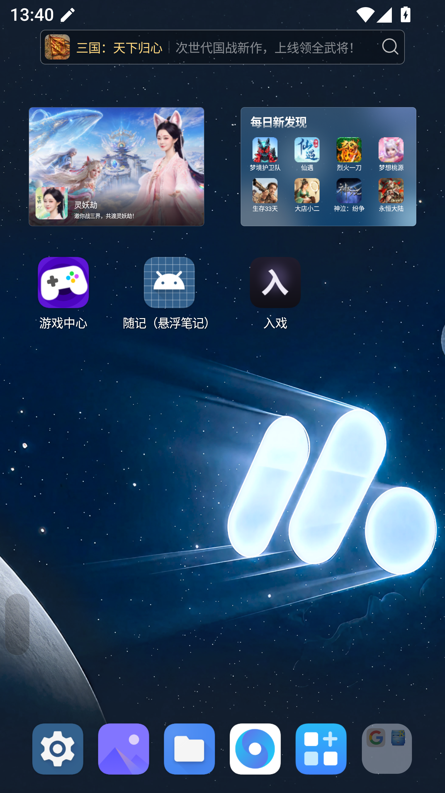
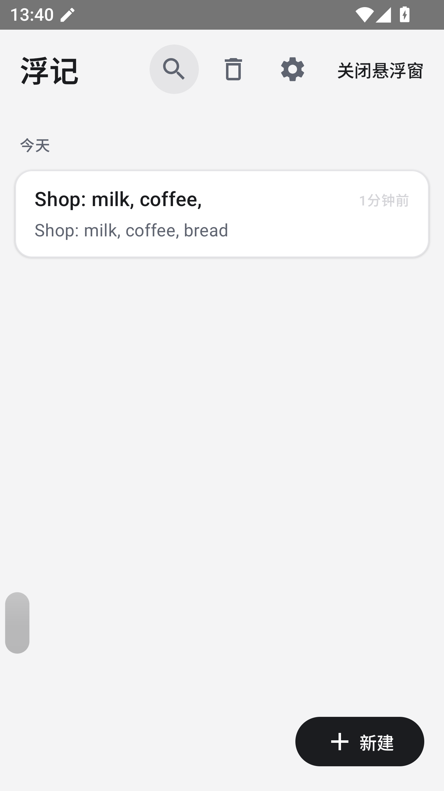

# 随记（悬浮笔记）FloatNote

一个 Android 悬浮笔记应用：任何时候，从屏幕边缘轻点唤出一个笔记窗口，写完收起，回到刚才在做的事。不打断，是它存在的全部理由。





> 截图待补（`docs/screenshots/` 内有说明），功能可直接构建体验。

## 它是什么样的

- **贴边竖条**：平时只在屏幕边缘留一根低调的半透明竖条（约 30% 透明度，可调），几乎不占注意力
- **一点即开**：点竖条，笔记窗口原位浮现；点窗口左侧的长条手柄，整窗轻移淡出、竖条原位归来
- **长条手柄**：窗口左缘（或右缘）的一体式长条——轻点收起、按住拖动移窗，与窗口同材质的渐变质感
- **左右镜像**：工具栏 ⇄ 键一键整窗翻到屏幕另一侧，长条/缩放手柄/工具栏顺序全部镜像，单手党左右通吃
- **键盘避让**：窗口在屏幕下半时唤起键盘，窗口自动浮到键盘上方；键盘收起自动落回
- **双指缩放**：随手调整窗口大小，按钮工具栏自动适配宽度永不出现半个按钮
- **自动保存 + 回收站**：1 秒防抖自动保存；删除先进回收站保留 30 天
- **备份**：一键导出全部笔记为纯文本，可从文件导入（自动跳过重复）

## 主界面

- 笔记列表：搜索（标题+正文）、置顶、长按操作
- 编辑器：有序/无序列表、待办、时间戳，回车自动续点
- 设置：悬浮窗外观（颜色/透明度/质感三档/圆角/厚度/长度）、贴边方向、开机自启、备份等，全部实时生效

## 技术栈

Kotlin · Jetpack Compose（主界面）+ 传统 View（悬浮窗，overlay 用 View 最稳）· Room（数据库，含无损迁移）· DataStore Preferences · Coroutines/Flow · 单 Activity + 单前台服务持有全部 overlay 窗口

## 构建

```bash
git clone <本仓库>
cd FloatNote
gradlew assembleDebug     # Debug 包
gradlew assembleRelease   # Release 包（沿项目惯例使用 debug 签名，如需发布请自行配置签名）
```

要求：JDK 17+、Android SDK（compileSdk 35，minSdk 26）。单元测试：`gradlew testDebugUnitTest`。

## 从源码安装

构建产物位于 `app/build/outputs/apk/`。安装后请在应用内开启「悬浮窗」，并按系统引导授予"显示在其他应用上层"权限。

## 路线图

- [ ] 首启隐私协议弹窗（上架合规）
- [ ] 多笔记切换（悬浮窗内）
- [ ] 主题与深色模式

## 许可

[MIT](LICENSE)——可自由使用、修改、分发，请保留版权声明。

## 致谢

本项目由 AI 结对开发（设计、架构、编码、测试全程人机协作），交互细节经过真机反复打磨。
